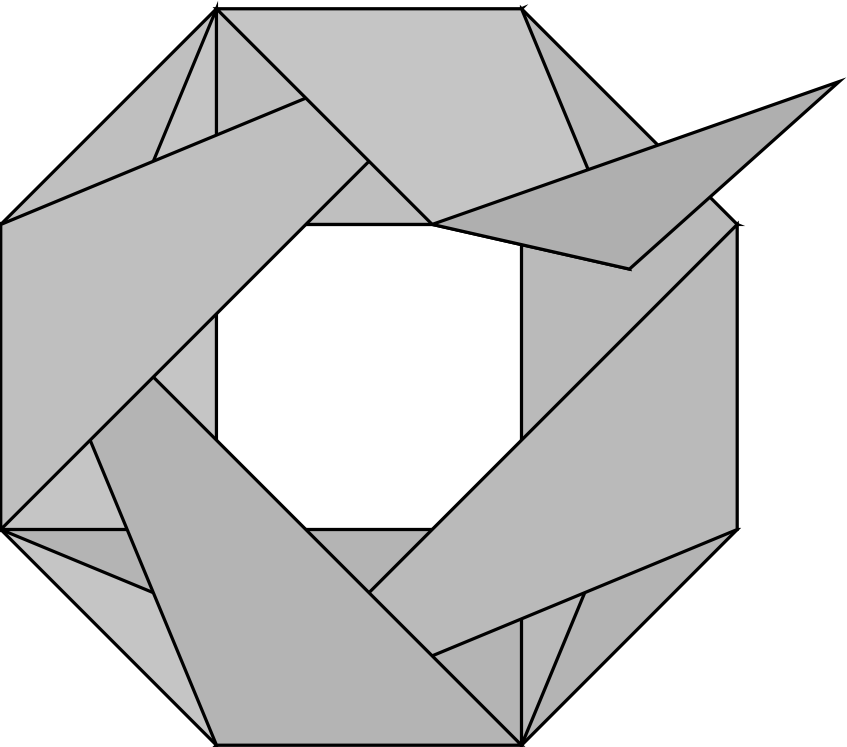

# Octant

<br />
<p align="center">
  <a href="https://github.com/nicolasAmat/Octant">
    
  </a>
  <p align="center">
    A tool to project Petri nets reachability properties
    <!-- <br />
    <a href="https://github.com/nicolasAmat/Octant#features"><strong>see what's new »</strong></a>
    <br /> -->
    <!-- <a href="https://github.com/nicolasAmat/Octant">View Demo</a> -->
  </p>
</p>

## About

Octant is a pre-processor that can be used to accelerate the verification of
generalized reachability properties on Petri nets. It takes advantage of
*structural reductions* and work by projecting an *initial reachability
property* into a simpler one, that can be checked on the reduced version of the
Petri net.

The tool is named after the [Octant map
projection](<https://en.wikipedia.org/wiki/Octant_projection>) proposed by
Leonardo da Vinci in 1508; the first known example of a polyhedral map
projection.

This project was initially developed inside [TiPX](https://github.com/lebotlan/tipx), a Petri net explorer.

## Installation

You can build an executable by compiling the project from its source, using the
accompanying `Makefile`. The tool is written in OCaml and uses the Dune build
system. You can also download the latest build of the tool, compiled for Linux,
called
[`octant.exe`](https://github.com/nicolasAmat/Octant/blob/linux/octant.exe), on
the "linux" branch of the repository

## Running the tool

```
./octant.exe command1 command2 ... commandn
```

Octant is a CLI tool that operates over its parameters as if they were a
sequence of commands for a stack-based language. Each command takes its
arguments from the stack and/or from the command-line.

+ `p` means 'pop' (stack argument)
+ `r` means 'reads a command-line argument'  
+ `1` means pushes one value
+ `*` means pushes multiple values  

Additionally, a global environment consists in bindings of the form  

+ name => formula  
+ name => bundle (that is: a Petri net, an initial marking, and possibly a tfg).  

### Environment

`load        : r -> 0`    - (implicit) -  Load the given Petri net, put it as a bundle in the environment with the name 'net'. E.g.: load "file.net".  
`bind        : rp -> 0`   -  Binds the element on the stack to the given name. E.g.: bind special-net.  
`set         : rp -> 0`   -  Synonym to bind.  
`get         : r -> 1`    - (implicit) -  Gets the element associated to the given identifier in the environment. Pushes it. E.g.: get special-net.  

### Formulas

`form        : r -> 1`    -  Parse and push the given formula(s) on the stack (as a list). The reference bundle is the last found in the environment.  
`load-forms  : r -> 1`    -  Read formulas from the given file and push them on the stack (as a list). The reference bundle is the last found in the environment.  
`project     : p -> 1`    -  Projects a list of formulas (popped from the stack). The reference bundle must have a tfg. Pushes the resulting list of formulas.  
`tproject    : rp -> 1`   -  Projects with a time limit.

### Display

`quiet       :  -> 0`     -  Quiet mode (prints only necessary information, e.g. verdicts).  
`smt-format  :  -> 0`     -  Use smt-lib format when printing formulas.  
`print       : p -> 0`    -  Pops and prints the topmost stack element.  
`fprint      : p -> 0`    -  Full print: print the topmost stack element, with details.  
`nl          :  -> 0`     -  Prints a blank line (separator).  

### Others

`time        :  -> 0`     -  Prints the delay since the previous time command. The first time command does not print anything.  
`dup         : p -> 2`    -  Duplicate the argument on top of the stack.  
`pop         : p -> 0`    -  Discards the topmost stack element.  
`help        :  -> 0`     -  Display this help.  

## Dependencies

The code repository includes OCaml libraries developed by Didier Le Botlan (outside this project) located inside folder `lib/`.

## License

This software is distributed under the
[GPLv3](https://www.gnu.org/licenses/gpl-3.0.en.html) license.

## Authors

+ Nicolas Amat - LAAS/CNRS
+ Didier Le Botlan - LAAS/CNRS
